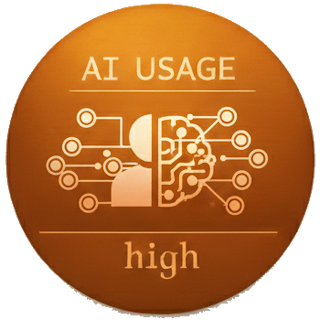
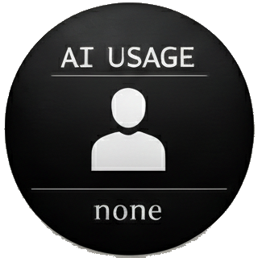
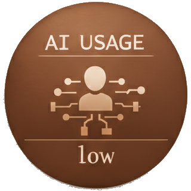

# AI Usage Badges

This repository contains a set of **AI Usage badges** that can be added to any project to clearly communicate the level of AI involvement in its development.

The goal of these badges is to promote **transparency**, **clarity** and **honest disclosure** about how AI tools were used (if at all) in a project.

## 🎯 Why These Badges?

As AI becomes more integrated into software development and other types of work, transparency matters.\
These badges provide a simple and standardized way to communicate:

- How AI contributed to the project
- The level of human involvement
- The development approach used

## 🔖 Available Badges

| None | Low | Medium | High | Full |
|:----:|:---:|:------:|:----:|:----:|
|  No AI tools used |  Minimal AI assistance |  Moderate AI involvement |  Significant AI usage |  Fully AI generated |

### None

Indicates that no AI tools were used in the creation of the project. None at all, even for assets.

### Low

Indicates minimal AI assistance (e.g., minor code suggestions, small refactors, documentation help or assets).

### Medium

Indicates moderate AI involvement (e.g., partial code generation, structured assistance or iterative improvements).

### High

Indicates significant AI usage in development (e.g., large portions of code generated or heavily AI-assisted workflows).

### Full

Indicates that the project was completely generated using AI tools. The human has only given guidelines.

## 💡 Contribute

This work is for all of us.\
Feel free to contribute improvements or alternative designs! I'm not a designer and I did the badges... with AI.\
If you like it and are a graphical designer, we can create different sets for the same purpose.\
Also, SVG versions are welcome. Currently, they are 320x320 PNG format.

## 📜 License

All badges in this repository are **completely free to use**.

You are free to:

- Use them in personal or commercial projects.
- Redistribute them.
- Include them in open-source or private repositories.

No attribution is required (although appreciated).
Read [LICENSE](./LICENSE) for more details.
